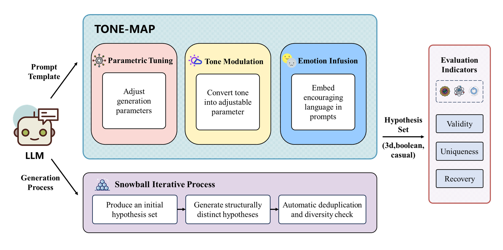
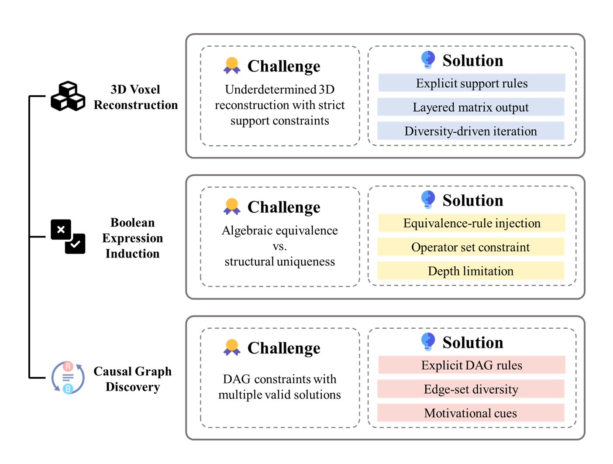

<div align="center">

# 🌌 **TONE-MAP**

### *Unlocking LLM Potential for Superior Structured Reasoning*

[](https://www.python.org)
[](https://opensource.org/licenses/MIT)
[](https://github.com/psf/black)

<p align="center">
  
</p>
</div>

**TONE-MAP** (Tone–Emotion–Parametric Modulation for Advanced Prompting) is a next‑generation framework that elevates Large Language Models (LLMs) from passive responders into **active scientific collaborators**.  

By integrating **parametric tuning, tone modulation, and emotion infusion**, TONE-MAP systematically enhances **multi-hypothesis generation** across underdetermined scientific tasks.

---

## ✨ Key Contributions

### 🧮 Multi-Hypothesis Evaluation  
Goes beyond single-answer correctness by introducing **Validity (V)**, **Uniqueness (U)**, and **Recovery (R)** as core evaluation metrics.

| Metric | Symbol | What It Measures |
|--------|--------|------------------|
| 🎯 **Validity** | *V* | Precision of hypotheses consistent with observations |
| ✨ **Uniqueness** | *U* | Non-redundancy among generated hypotheses |
| 📈 **Recovery** | *R* | Coverage of the admissible hypothesis space |

---

### 🌐 Three-Domain Benchmarks

- 📦 **3D Voxel Reconstruction**: Inferring 3D structures from 2D projections under physical constraints.  
- 🔀 **Boolean Logic Induction**: Discovering algebraically unique Boolean expressions consistent with observations.  
- 🧬 **Causal Graph Discovery**: Generating valid DAGs under multi-solution uncertainty.  

<p align="center">
  
</p>

---

### 🧭 Novel Prompting Paradigm

- ⚙️ **Parametric Tuning**: Lightweight fine-tuning with diversity rewards.  
- 🗣️ **Tone Modulation**: Adaptive control of reasoning style (direct vs. exploratory).  
- 💡 **Emotion Infusion**: Motivational cues that stimulate exploration and rigor.  

---

## 📂 Project Structure

```
📂 TONE-MAP/
│
├── 🗄️ checkpoints/              # Saved model checkpoints
├── ⚙️ config/                   # Task-specific YAML configs
│   ├── 📦 config_3d.yaml
│   ├── 🔀 config_boolean.yaml
│   └── 🧬 config_causal.yaml
├── 📊 datasets/                 # Benchmark datasets
├── 📑 results/                  # Experimental outputs
└── src/
    ├── 🚀 benchmark/
    │   ├── 📚 modules/
    │   │   ├── llm_interface.py
    │   │   ├── models.py
    │   ├── 📦 3d_benchmark.py
    │   ├── 🔀 boolean_benchmark.py
    │   ├── 🧬 causal_benchmark.py
    └── 🔧 generate_dataset/
        ├── 📦 3d_dataset.py
        ├── 🔀 boolean_dataset.py
        ├── 🧬 causal_dataset.py
        └── 🧬 causal_dataset_for_large.py
```
---

## 🚀 Quick Start

### Step 1️⃣: Configure Your LLM

Edit the YAML config files in each domain's `config/` folder:

**What you can customize:**
- 🤖 LLM provider and model
- 🌡️ Temperature & sampling parameters
- 📂 Output paths
- 💾 Checkpoint directories

**Example:** `config/config.yaml`

```yaml
llm:
  type: gemini              # Options: gemini, openai, anthropic, openrouter
  models:
    gemini: "gemini-2.5-flash"
  api_keys:
    gemini: "your-api-key"  # ⚠️ Replace with your actual API key
  temperature: 0.7              # 0.0 = deterministic, 1.0 = creative
  top_p: 0.9                     # Nucleus sampling parameter
benchmark:
  checkpoint: "checkpoints"     # Resume interrupted runs
  verbose: true                 # Print detailed logs
  output_pattern: "results/{dataset_name}_{model}.json"
```

### Step 2️⃣: Generate Datasets

Each domain has its own dataset generator. Here are examples for all three:

<details>
<summary><b>🧬 Causal Graphs</b> (click to expand)</summary>

```bash
python src/generate_dataset/causal_dataset.py `
  --nodes 3 `
  --seed 33550336 `
  --output "datasets/node03/n3_all_observations.json"
```
```bash
python src/generate_dataset/causal_dataset_for_large.py `
  --nodes 3 `
  --seed 33550336 `
  --output "datasets/node03/n3_all_observations_for_large.json"
```

**Parameters:**
- `--nodes`: Number of nodes in graphs (3, 4, 5, etc.)
- `--seed`: Random seed for reproducibility
- `--output`: Path to save dataset JSON

</details>

<details>
<summary><b>📦 3D Voxel Reconstruction</b> (click to expand)</summary>

```bash
python src/generate_dataset/3d_dataset.py `
  --grid-size 3 `
  --max-height 3 `
  --max-blocks 1 `
  --fixed `
  --seed 33550336 `
  --output "datasets/3d_grid3_h3.json"
```

**Parameters:**
- `--grid-size`: Grid dimensions (e.g., 3 for 3×3)
- `--max-height`: Maximum structure height
- `--max-blocks`: Maximum number of blocks in top view
- `--fixed`: If set, generate only structures with exactly max-blocks blocks, else from 1 to max-blocks
- `--output`: Output file path

</details>

<details>
<summary><b>🔀 Boolean Logic</b> (click to expand)</summary>

```bash
python src/generate_dataset/boolean_dataset.py `
  --operators basic `
  --max-depth 2  `
  --seed 33550336 `
  --output  'datasets/boolean_2var.json' `
 
```

**Parameters:**
- `--operators`: Allowed Boolean operators: choices=['basic', 'extended', 'full']
- `--max-depth`: Maximum expression depth
- `--output`: Output JSON file

</details>

### Step 3️⃣: Run Benchmarks

Run the benchmark for your chosen domain:

<details>
<summary><b>🧬 Causal Benchmark</b></summary>

```bash
python src/benchmark/causal_benchmark.py `
  --dataset "datasets/node03/n3_all_observations.json" `
  --config "config/config_casual.yaml" `
  --n-samples 30 `
  --query-multiplier 1.0 `
  --seed 33550336
```
```bash
python src/benchmark/causal_benchmark.py `
  --dataset "datasets/node03/n3_all_observations_for_large.json" `
  --config "config/config_casual.yaml" `
  --n-samples 30 `
  --query-multiplier 1.0 `
  --seed 33550336
```

</details>

<details>
<summary><b>📦 3D Benchmark</b></summary>

```bash
python src/benchmark/3d_benchmark.py `
  --dataset "datasets/3d_grid3_h3.json" `
  --config "config/config_3d.yaml"  `
  --n-samples 30 `
  --query-multiplier 1.0 `
  --seed 33550336
```

</details>

<details>
<summary><b>🔀 Boolean Benchmark</b></summary>

```bash
python src/benchmark/boolean_benchmark.py `
  --dataset "datasets/boolean_2var.json" `
  --config "config/config_boolean.yaml" `
  --n-samples 30 `
  --query-multiplier 1.0 `
  --seed 33550336
```

</details>

**Common Parameters:**
- `--dataset`: Path to generated dataset
- `--config`: Configuration YAML file
- `--n-samples`: Number of observation sets to evaluate
- `--query-multiplier`: Multiplier for queries per task
- `--seed`: Random seed for reproducibility

### Step 4️⃣: Analyze Results

Results are automatically saved as JSON files in the `results/` directory.

**What's included:**

```json
{
  "metadata": {
    "model": "gemini-2.5-flash",
    "dataset": "causal_n3",
    "n_samples": 30,
    "timestamp": "2025-10-17T12:00:00"
  },
  "aggregate_metrics": {
    "mean_validity": 0.92,      // 🎯 How many proposals are valid
    "mean_uniqueness": 0.78,    // ✨ How diverse are the proposals
    "mean_recovery": 0.65,      // 📈 Coverage of solution space
    "std_validity": 0.08,
    "std_uniqueness": 0.12,
    "std_recovery": 0.15
  },
  "results": [/* detailed per-sample results */]
}
```

**Understanding the Metrics:**

| Metric | Range | Good Score | Interpretation |
|--------|-------|------------|----------------|
| 🎯 **Validity** | 0-1 | > 0.90 | Model proposes correct hypotheses |
| ✨ **Uniqueness** | 0-1 | > 0.80 | Model avoids redundant proposals |
| 📈 **Recovery** | 0-1 | > 0.80 | Model explores solution space well |

---

## 📊 Supported Models

| Provider       | Example Models                                          | Config Type  |
|----------------|---------------------------------------------------------|--------------|
| 🟦**Google**     | Gemini-2.5-pro, Gemini-2.5-flash, Gemini-2.5-flash-lite | `gemini`     |
| 🟩**OpenAI**     | GPT-4o, GPT-4-turbo, GPT-3.5                            | `openai`     |
| 🟨**OpenRouter** | Any model via OpenRouter                                | `openrouter` |

---
## 🧠 Conceptual Framework
- 📝 **Prompt Construction**: Role definition + tone prefix + emotional cue + task data + structural rules.

- 🔄 **Iterative Hypothesis Expansion**: Snowball-style generation with enforced structural diversity.
 
- 🧹 **Automatic Deduplication**: Graph isomorphism, voxel matching, and Boolean simplification.

- 📐 **Evaluation**: V/U/R metrics quantify scientific reasoning capacity.

---
## 📌 Future Directions
- 🤝 **Reinforcement Learning Integration**: Coupling TONE-MAP with search and RL for deeper exploration.

- 🖼️ **Multimodal Expansion**: Extending to image–text scientific reasoning.

- 🌍 **Cross-Task Transfer**: Validating generality across domains.

---
## 📝 Citation

If you use HypoSpace in your research, please cite:

```bibtex
@article{tone-map2025,
  title   = {Unlocking LLM Potential: The TONE-MAP Framework for Superior Structured Reasoning},
  author  = {Jun Shen and Uylee Wu},
  journal = {Preprint},
  year    = {2025}
}
```

---

## 📄 License

Distributed under the MIT License. See **LICENSE** for details

---

<div align="center">

**Built with ❤️ for scientific discovery**

⭐ Star us on GitHub • 🐛 Report issues • 💡 Suggest features

</div>
